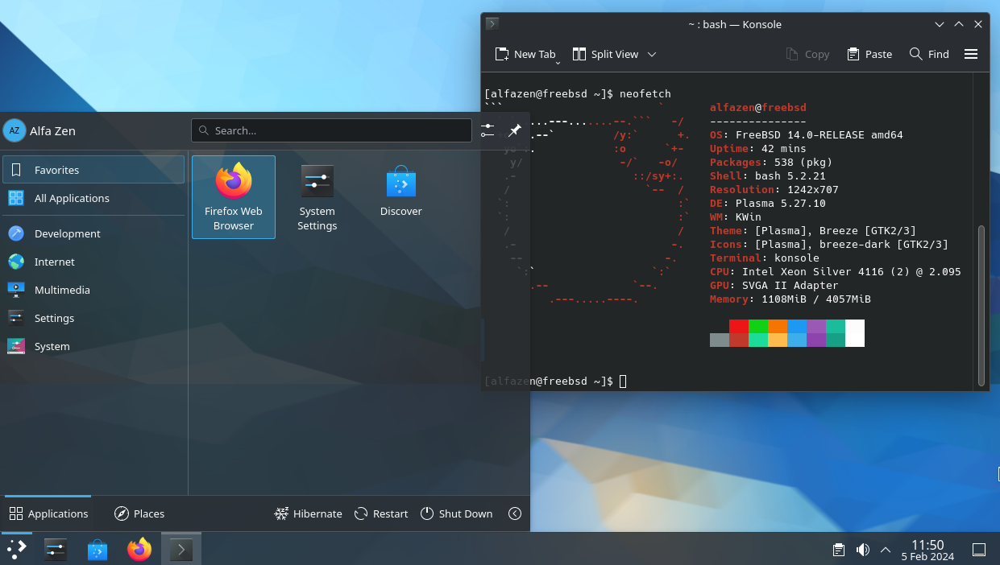

# FreeBSD GUI AutoInstaller on VMware

by Marcus Zou


## 1- Intro

A simple guide to install the **KDE5** / **Xfce4** Desktop Environment on **FreeBSD 14.0-RELEASE** running as a guest operating system on VMware (tested on VMware Fusion 13.5.0, VMware Workstation 17.5.0). 

The relevant configuration scripts are provided as is.


## 2- Snapshot of KDE5-Lite with FreeBSD 14




## 3- Pre-Requisites

* Download the ISO or VMDK of FreeBSD 14 and install it as a guest operating system on VMware.

  * AMD64-ISOs: [FreeBSD-14.0-RELEASE](https://download.freebsd.org/releases/amd64/amd64/ISO-IMAGES/14.0/)
  * AMD64-VMs: [FreeBSD-14.0-VM-IMAGES](https://download.freebsd.org/releases/VM-IMAGES/14.0-RELEASE/amd64/Latest/)
  * ARM64(M1/M2)-VMs: [FreeBSD-14.0-VM-IMAGES](https://download.freebsd.org/releases/VM-IMAGES/14.0-RELEASE/aarch64/Latest/)

* Install a few package:

  ```
  pkg update && pkg upgrade
  pkg install bash nano sudo curl wget git neofetch  
  ```

* Apart from the `root` user, we will create a common user, say `alfazen`, and add the user into groups of `wheel`, `video`, `operator` during creation, also change the shell to `bash`. 

  Changing the Shell from the default `sh` to `bash` furnishes some flexibilities to customize the Shell in the future.

  ```
  adduser
  ```

* (Optional) Add user to `wheel`, `video`, `operator` groups if we forget to do so in previous step:

  ```
  pw groupmod wheel -m alfazen
  pw groupmod video -m alfazen
  pw groupmod operator -m alfazen
  ```

* modify `/usr/local/etc/sudoers`  to insert the line below:

  ```text
  alfazen ALL=(ALL:ALL) ALL
  ```

  and optionally **uncomment** the following 3 rows:

  ```
  # %wheel ALL=(ALL:ALL) ALL
  # %wheel ALL=(ALL:ALL) NOPASSWD: ALL
  # %sudo ALL=(ALL:ALL) ALL 
  ```

* Reboot, login as the common user, `alfazen`, check the shell version

  ```bash
  echo $SHELL
  ```

Note: Hardware acceleration doesn't currently work with FreeBSD on VMware. The driver was [removed](https://github.com/freebsd/drm-kmod/commit/ff9d303c7ea85cd8627d0a3dc0dbccceefd30687)


## 4- Auto-Install KDE5

Login as the Common User, Download the script from GitHub and execute the `bash` script.

```bash
git clone https://github.com/marcuszou/FreeBSD-GUI-AutoInstaller-VMware.git
cd FreeBSD-GUI-AutoInstaller-VMware
sudo bash ./kde-install.sh
```


## 5- Auto-Install KDE5-Lite (Preferred)

KDE5 is very beautiful, but heavy-duty, there is another Lite version of KDE5: **LXDT** though. Whilst I prefer the real **KDE5-Lite**, which is actually **plasma5-plasma**.

```bash
git clone https://github.com/marcuszou/FreeBSD-GUI-AutoInstaller-VMware.git
cd FreeBSD-GUI-AutoInstaller-VMware
sudo bash ./kde-lite-install.sh
```


## 6- Auto-Install Xfce4

Login as the Common User, Download the script from GitHub and execute the `bash` script.

```bash
git clone https://github.com/marcuszou/FreeBSD-GUI-AutoInstaller-VMware.git
cd FreeBSD-DeskEnv-AutoInstaller-VMware

sudo bash ./xfce-install.sh
```

If the Common User is in `sh` shell, the last command above shall be:

```sh
sudo sh ./xfce-install-reg-sh.sh
```


## 7- Reboot and Login

Nothing special but enjoyable experiences


## 8- More Documents

* [FreeBSD 14 -1- GUI Install Roadmap](docs/FreeBSD14-1-GUI-Install-Roadmap.md)
* [FreeBSD 14 -2- Auto-Install KDE5](docs/FreeBSD14-2-Auto-Install-KDE5.md)
* [FreeBSD 14 -3- Auto Install GNOME](docs/FreeBSD14-3-Auto-Install-GNOME.md)
* [FreeBSD 14 -4- Audio - Quick Guide](docs/FreeBSD14-4-Audio-Quick-Guide.md)
* [FreeBSD 14 -5- Ports and Apps](docs/FreeBSD14-5-Ports-and-Apps.md)
* [FreeBSD 14 -6- VNC and RDP](docs/FreeBSD14-6-VNC-and-RDP.md)
* [FreeBSD 14 -7- Oh My Bash on FreeBSD](docs/FreeBSD14-7-Oh-My-Bash-on-FreeBSD.md)
* [FreeBSD 14 -8- Resize UFS/ZFS Partition in Physical Computer or VM](docs/FreeBSD14-8-Resize-UFS-ZFS-Partition-in-Physical-Computer-or-VM.md)
* [FreeBSD 14 -9- Auto Install LXQT](docs/FreeBSD14-9-Auto-Install-LXQT-NotSoGood.md)
* [FreeBSD 14 -10- Shared Folder - Finale](docs/FreeBSD14-10-Shared-folder-from-Windows-Linux-Host-to-FreeBSD-Guest.md)


## 9- Versions and Builds

v0.9.b20240211 - shared-folder to FreeBSD guest - the best solutions ever!<br>
v0.8.b20240208 - fully tested GNOME - issue of `networkmgr` icon.<br>
v0.7.b20240207 - fully tested okay auto-installing LXQT on FreeBSD vs. on AlmaLinux.<br>
v0.6.b20240206 - VNC/RDP function tested okay, take this as the finale.<br>
v0.5.b20240205 - fixed issue keyboard not working @ login, custom-Bash, audio tested okay.<br>
v0.4.b20240205 - fully tested okay on FreeBSD+KDE5/Xfce4/KDE5-Lite/LXQT, plus SSH function.<br>
v0.3.b20240204 - introduced grabbing latest update of FreeBSD 14-RELEASE, quarterly/latest tested.<br>
v0.2.b20240203 - built and finetuned scripts for FreeBSD14+KDE5 on self-installed VM.<br>
v0.1.b20240203 - first tested auto-installer for FreeBSD14+Xfce4 on official VM.<br>


## License

MIT License
