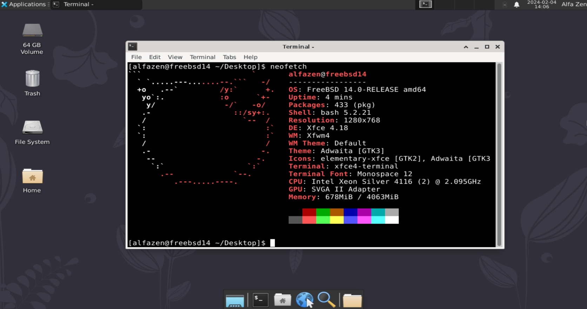

# FreeBSD Xfce4 on VMware AutoInstaller

A guide to install the **Xfce4** Desktop Environment on **FreeBSD 14.0-RELEASE** running as a guest operating system on VMware (tested on VMware Fusion 13.5.0, Workstation 17.5.0). This guide includes configuration files and an optional configuration script.




## Pre-Requisites

* FreeBSD installed as a guest operating system on VMware.

  * [FreeBSD-14.0-RELEASE](https://download.freebsd.org/releases/amd64/amd64/ISO-IMAGES/14.0/)
  * [FreeBSD-13.2-RELEASE](https://download.freebsd.org/releases/amd64/amd64/ISO-IMAGES/13.2/)

* Installation of a few package:

  ```
  pkg install bash nano sudo curl wget git neofetch  
  ```

* Create a common user `alfazen`, adding into groups of `wheel`, `video`.

* modify `/usr/local/etc/sudoers` :

  ```
  alfazen ALL=(ALL:ALL) ALL
  ```

Note: Hardware acceleration doesn't currently work with FreeBSD on VMware. The driver was [removed](https://github.com/freebsd/drm-kmod/commit/ff9d303c7ea85cd8627d0a3dc0dbccceefd30687)


## Login as a Common User and Run the commands below

```bash
git clone https://github.com/marcuszou/FreeBSD-Xfce4-AutoInstaller-VMware.git
cd FreeBSD-Xfce4-AutoInstaller-VMware
sudo bash ./xfce-install.sh
# sudo ./xfce-install.sh # if the user is in sh
```


## Reboot and Login

Nothing special but enjoyable experiences


## More Documents

[FreeBSD14-AutoInstall-Xfce4-Methods](FreeBSD14-AutoInstall-Xfce4-Methods.md)


##### The end
